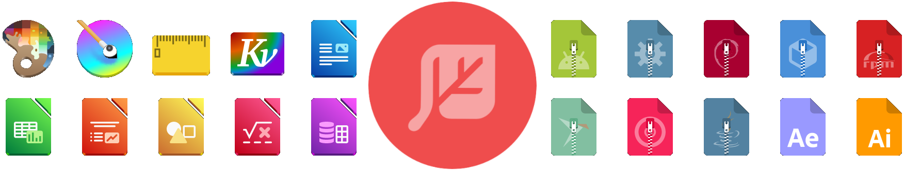
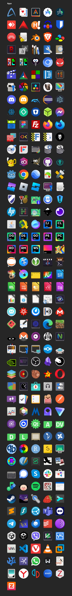
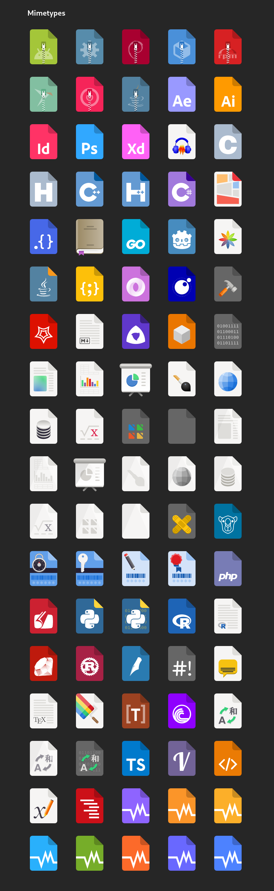
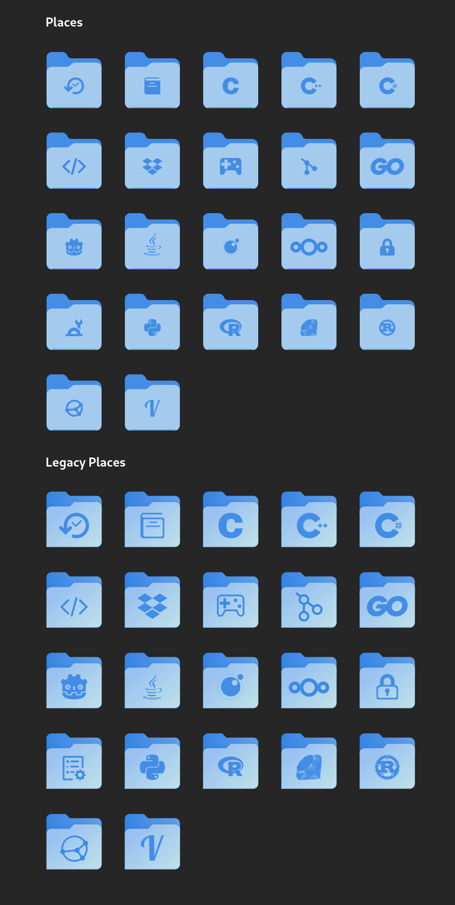

# NeoWaita

A fusion of best icon themes that adhere to Adwaita's design
philosophy to extend GNOME's Shell's original icon set.

> The purpose of this theme is to provide third-party apps
> with a consistent look and feel in Gnome Shell.

<p align="center">
    
</p>

[](https://github.com/dwyl/esta/issues)
[](https://img.shields.io/github/license/NeoWaita/NeoWaita)


## Installation

Currently, the icon theme does not have any package. Hence, it requires
to be installed manually via `git`:

```bash
git clone https://github.com/NeoWaita/NeoWaita
cd NeoWaita
sudo ./install.sh # for system-wide installation
# or ./install.sh for local installation
```

To apply the icon theme, you can use GNOME Tweaks or use `gsettings`:

```bash
gsettings set org.gnome.desktop.interface icon-theme 'NeoWaita'
```

## Update

If you are using the `git` version, you can sync with the latest,
currently the branch `NeoWaita:47`, using:

```bash
cd /usr/share/icons/NeoWaita
# or $HOME/.local/share/icons/NeoWaita
sudo git fetch
# only git fetch for local installation
```

## Uninstall

```bash
sudo rm -rf /usr/share/icons/NeoWaita # for system wide
# rm -rf $HOME/.local/share/icons/NeoWaita
```

# Using custom folder icons

1. Open Files (Nautilus).
2. Find the folder you wish to change the icon.
3. Right click on the folder.
4. Click on `Properties`.
5. Click on the folder image.
6. Navigate to the NeoWaita installation folder and into
the `places` subfolder (`/places/scalable/`).
7. Select the icon you wish to use.
8. Click `Open`.

# Troubleshooting

## Theme doesn't apply

If the theme doesn't apply try the following command:

```bash
# local installation
gtk-update-icon-cache -f -t /usr/share/icons/NeoWaita && xdg-desktop-menu forceupdate
# for system wide
# sudo gtk-update-icon-cache -f -t /usr/share/icons/NeoWaita && xdg-desktop-menu forceupdate
```

## Some apps don't get themed

If the theme applies, but a particular app doesn't get
themed (and its icon is in NeoWaita), check its respective
`.desktop` file. Some apps have icon paths hardcoded into
their `.desktop` file or have a different icon name set
there or no icon set at all. This can differ between distros.
If you happen to have such apps, you'll need to copy their
`.desktop` files into `~/.local/share/applications` and
modify them there providing the correct icon name.

If your app's `.desktop` file references an icon name not
present in NeoWaita's `apps/scalable` folder, please report
it in an issue providing the icon name from your system.

# Credits

This project will not exists without the work of
[@somepaulo](https://github.com/somepaulo). This project is
based upon [MoreWaita](https://github.com/somepaulo/MoreWaita)
which provides its foundation.

> This theme is built mostly upon the work of Gnome's Adwaita
> designers and Gnome Circle apps' developers, as well as
> Papirus theme designers,  with a touch of tinkering from
> [@somepaulo](https://github.com/somepaulo),
> [@dusansimic](https://github.com/dusansimic),
> [@julianfairfax](https://github.com/julianfairfax) and others
> here and there. The theme provides icons for the most popular
> apps people really do install and use, and also covers the most
> frequently installed dependency GUI apps that almost nobody
> uses (like Avahi browsers, QT Designer, Software token, etc.).
>
> The goal of NeoWaita is to add to Adwaita, not modify it, and
> to do roughly what Breeze does for KDE. This theme does not
> override any Adwaita icons, nor any Gnome Circle apps icons,
> nor icons that generally fit into the Adwaita paradigm (like
> Transmission GTK). Currently, this theme is way less all-inclusive
> than many others, but the aim is to be on par with Papirus
> some day. However, this is (mostly) a one-man hobby effort,
> albeit with some greatly appreciated help, so suggestions,
> requests, PRs and contributions are very welcome. In the
> meantime, I'll focus on adding icons that the community is requesting.
>
> For most icons, especially branded ones, the general idea is
> to stay as close as possible to the original icons – to the
> point of using them in full – and giving them the distinct
> Adwaita 'perspective' and general flatness. One thing this
> theme deviates from is the Gnome colour palette in brand icons
> – NeoWaita keeps the brand colours.
>
> This theme is built and tested against vanilla Gnome on Arch
> Linux. If an icon is in the theme, but is not applying to your
> app, please open an issue and mention the icon name referenced
> in your app's `.desktop` file.

Please consider donating to the original authors of the
project, [@somepaulo](https://github.com/somepaulo):

- [ko-fi](https://ko-fi.com/somepaulo)
- [PayPal](http://paypal.me/pfino/5)

# The Icons

_These screenshots show icons currently in git, versioned
releases may be behind_




